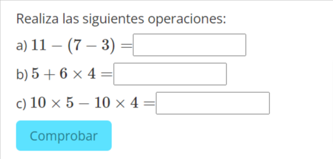

# Conociendo el entorno de la pregunta STACK

## Introducción

Vamos a explorar la "pinta" que tiene una pregunta `STACK` a través de la exploración de un ejemplo.

 ESTA DOCUMENTACIÓN SE ELABORÓ DURANTE EL VERANO DE 2020 Y NO SE ACTUALIZA 

***

## Archivo `xml` de la pregunta

El archivo está en formato `XML de Moodle`.

[Enlace al archivo](images/OperacionesCombinadasNaturales.xml)

***

## Vista previa de la pregunta

***

## Vista general de la pregunta

Veamos la pinta que tiene una pregunta STACK.

***

## Variables de la pregunta (1)

En este campo, es donde se define toda la lógica de la pregunta:

+ Definición de las variables.
+ Operaciones entre las variables.
+ Comentarios al código.


 
 

Debemos emplear el lenguaje de [`Máxima CAS`](https://maxima.sourceforge.io/es/index.html).

La referencia completa de lo que se puede hacer con `Máxima` se puede encontrar [aquí](https://maxima.sourceforge.io/docs/manual/es/maxima_toc.html#SEC_Contents). Y en [esta otra página](https://maxima.sourceforge.io/es/documentation.html) también se pueden encontrar múltiples recursos.

En la pregunta de la imagen tenemos:
1. Un comentario en que explicamos cuál es el apartado 1).
2. La definición de tres variables, `n1`, `n2` y `n3`.
   1. `n1` tomará valores naturales entre 10 y 15.
   2. `n2` tomará valores naturales entre 6 y 9.
   3. `n3` tomará valores aleatorios entre 2 y 4, por lo que valdrá 2, 3 o 4.
3. La definición de la variable solución `solA: n1-(n2-n3)`.



***********************

## Enunciado de la pregunta (2)

En esta parte, definiremos el enunciado que se mostrará a los alumnos cuando visualicen la pregunta.

> Lo más recomendable es configurar el editor de `Moodle` como editor de **Texto plano** y utilizar el formato `HTML`.

*Vista en editor Atto*

*Vista en editor de texto plano*

En la siguiente animación se muestra cómo cambiar al editor de `Texto plano`.

> El editor de `Texto plano` nos proporcionará mucha mayor funcionalidad que el editor por defecto (`Atto`). 

<i class="fa fa-info-circle"></i> Además, el editor `Atto` da **problemas** cuando hay código `Javascript` en las preguntas.

Al principio, puede resultar algo complejo el manejo del `HTML`, pero uno se acostumbra relativamente rápido a su uso. Se puede encotrar una referencia muy detallada del uso de HTML en [esta página](https://www.w3schools.com/html/).

*******

Aspectos destacables del enunciado:

+ Para expresiones matemáticas, se puede emplear el lenguaje $\LaTeX$. Hay multitud de tutoriales en Internet. `\(` para iniciar contenido $\LaTeX$ y `\)` para finalizar la entrada de $\LaTeX$.
+ Podemos trasladar variables que hayamos definido en Variables de la pregunta.

Para “pasar” variables desde `Variables de la pregunta` hasta el `Enunciado de la pregunta` se puede:
+ Utilizar `{@nombreDeVariable@}` si queremos que la variable vaya en $\LaTeX$.
+ Utilizar `{#nombreDeVariable#}` para pasar simplemente la variable.

> Habrá diferencia entre ambos en el caso de fracciones, radicales, expresiones algebraicas complejas…

Un aspecto importante son los campos `[[input:ans1]]` `[[validation:ans1]]` `[[feedback:prt1]]`. Veamos qué significan:
+ `[[input:nombreCampoEntrada]]` indica que queremos que aparezca un campo de entrada de respuesta del usuario. Lo que habitualmente es un hueco para que el alumno conteste.
`[[validation:nombreCampoEntrada]]` es el lugar donde queremos que aparezca la validación de la entrada del usuario. No necesariamente se la mostraremos al usuario, pero por cada `[[input:nombreCampoEntrada]]`, hemos de tener un `[[validation:nombreCampoEntrada]]`.
`[[feedback:prt1]]` indica que queremos evaluar una o varias respuestas del usuario. Al ejecutar la pregunta, aquí se mostrará la corrección y/o el feedback que deseemos proporcionar al alumno.

***

## Notas de la pregunta (3)

Cuando preparemos preguntas que incluyan aleatoriedad, la nota de la pregunta será lo que diferencie a una pregunta de otra. Es interesante que sea un texto que resuma la pregunta para que así nos resulte más sencillo el despliegue de las distintas variantes de la pregunta.

> La nota de la pregunta debe ser **ÚNICA** para cada pregunta. `STACK` considera que dos preguntas son iguales si las notas de ambas son iguales.

***

## Entrada: nombreCampoEntrada

Tendremos uno por cada uno de los `input:nombreCampoEntrada` que hayamos incluido en el enunciado.

> Permiten configurar el tipo de entrada que esperamos del usuario.

Los campos más importantes son:

+ Tipo de entrada: permitirá definir qué esperamos que introduzca el usuario: entrada algebraica, numérica, texto, matrices, …
+ Respuesta modelo: será una respuesta correcta a la pregunta (podría haber más de una respuesta correcta). Este valor se utiliza cuando mostramos al alumno la respuesta correcta.
+ Tamaño de la caja: define lo “largo” que queremos que sea el campo de entrada.
+ Insertar asteriscos: para que el usuario no se tenga que preocupar de introducir siempre el signo de multiplicación. Si asumimos que las variables son de un único carácter, multiplicación implícita y para los espacios, el alumno podrá introducir $2ax+ab$ y nuestra pregunta “entenderá” que quiere decir $2 \cdot a \cdot x+a \cdot b$. En caso de no insertar asteriscos, el usuario debe introducir **todas** las multiplicaciones o la respuesta no se considerará válida.

En el ejemplo que se muestra hemos establecido:
+ La entrada es de tipo numérico.
+ La respuesta correcta es `solA`, que hemos definido inicialmente en las variables de la pregunta.
+ La anchura de la caja de respuesta es de 10.

***

## Árbol de respuestas potenciales: nombreDeParte

Aparecerá uno por cada uno de los `[[feedback:nombreDeParte]]` que hayamos incluido en el enunciado.

>Permiten:
>+ Realizaremos la **evaluación** de lo que ha introducido el alumno.
>+ Asignaremos **puntuación** a la respuesta obtenida.
>+ Daremos **feedback** a la respuesta obtenida.   

En la pregunta mostrada, se hacen dos comprobaciones sobre el campo de entrada `ans1`:
+ Nodo 1: que sea igual a `solA`, en cuyo caso la calificación es 1 (respuesta correcta). Si la comprobación no se cumpliera, pasamos al Nodo 2.
+ Nodo 2: si la respuesta es `n1-n2-n3`, lanzamos, como retroalimentación, que "Primero se calcula el paréntesis", ya que en lugar de `n1-(n2-n3)`, el alumno ha obviado la existencia del paréntesis y ha contestado erróneamente. Se cumpla o no esta comprobación, la calificación es 0.

>Definiendo adecuadamente nuestras comprobaciones a las respuestas de los alumnos, podremos **DAR INFORMACIÓN** acerca de los errores más habituales y **AYUDAR** a que entiendan por qué su respuesta es errónea.

